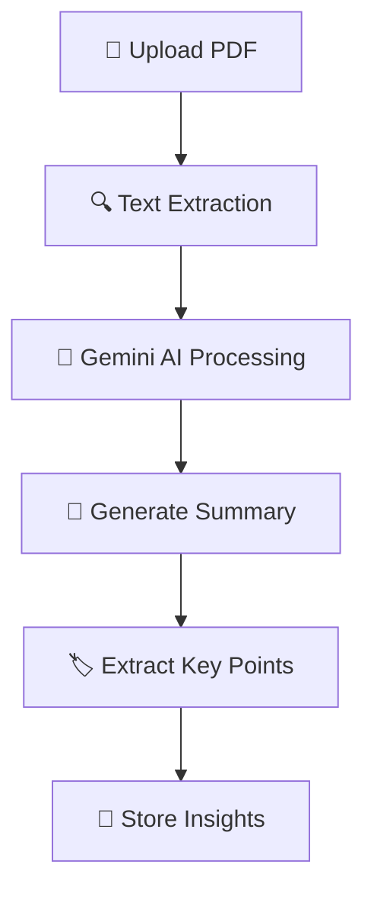

# 🤖 Aura – AI-Powered Study Partner
<div align="center">


[](https://github.com/username/aura/actions)
[](https://firebase.google.com/)
[](https://gemini.google.com/)


</div>


---

## 📖 Overview

**Aura** is a cutting-edge mobile application that transforms how students and learners interact with educational content. Built with Flutter and powered by Google's Gemini AI, Aura serves as your intelligent study companion that transcends traditional note-taking tools.

### 🎯 What Makes Aura Special

- **🧠 AI-Driven Intelligence**: Advanced document analysis powered by Gemini AI
- **📄 Smart Processing**: Automated summarization and key insights extraction
- **🌍 Multilingual Excellence**: Seamless English ↔ Arabic language support
- **⚡ Instant Results**: Real-time processing with offline capabilities
- **🎨 Intuitive Design**: Clean, responsive UI with dark/light theme support
- **🔒 Privacy First**: Secure authentication with Firebase integration

---

## ✨ Key Features

### 🤖 AI-Powered Document Analysis


- **OCR Integration**: Advanced text recognition from PDF documents
- **Multi-format Support**: Handles various document layouts and fonts
- **Intelligent Parsing**: Extracts structured information and metadata

### 📊 Smart Summarization Engine
- **Context-Aware Summaries**: Understands document context and generates relevant summaries
- **Multiple Summary Levels**: Concise overview, detailed summary, or key points only
- **Customizable Length**: Choose summary depth based on your needs
- **AI-Generated Abstracts**: Automated abstract creation with semantic understanding

### 🌐 Multilingual Experience
- **Real-time Translation**: Instant language switching without restart
- **Native Localization**: Culturally adapted content for Arabic and English users
- **RTL Support**: Full right-to-left layout support for Arabic interface
- **Voice Assistant Ready**: Multilingual voice command processing

### 💾 Advanced Data Management
- **Hive Database**: Lightning-fast local storage with reactive updates
- **Smart Caching**: Intelligent document caching with LRU eviction
- **Offline Processing**: Full functionality without internet connectivity
- **Cloud Synchronization**: Seamless cross-device document access

### 🎨 Enhanced User Experience
- **Material Design 3**: Modern UI with fluid animations and transitions
- **Accessibility First**: Screen readers, high contrast, and gesture support
- **Performance Optimized**: Smooth 60fps animations with hardware acceleration
- **Adaptive Layout**: Responsive design for all screen sizes and orientations


---

## 🛠 Technology Stack

### Core Framework & Platform
| Component | Version | Description |
|-----------|--------|-------------|
| **Flutter** | 3.6.2 | Cross-platform UI framework |
| **Dart** | 3.6.2 | Programming language for Flutter |
| **Android Gradle Plugin** | 8.0+ | Android build system |
| **Xcode** | 14+ | iOS development toolchain |

### AI & Machine Learning
| Component | Version | Purpose |
|-----------|--------|----------|
| **Flutter Gemini** | ^3.0.0 | Native AI integration |
| **Google Gemini AI** | ^0.4.7 | Language processing and summarization |
| **Syncfusion PDF** | ^30.1.41 | Professional PDF handling |
| **HTTP Client** | ^1.4.0 | API communication |

### Data Management
| Technology | Version | Features |
|------------|---------|----------|
| **Hive** | ^2.2.3 | NoSQL local database |
| **Shared Preferences** | ^2.2.2 | Key-value storage |
| **File Picker** | ^10.2.0 | Document selection |
| **Path Provider** | ^2.1.5 | File system access |

### UI/UX & Interactions
| Library | Version | Function |
|---------|---------|----------|
| **ScreenUtil** | ^5.9.0 | Responsive design |
| **Google Fonts** | ^6.2.1 | Typography system |
| **Lottie** | ^3.0.0 | Vector animations |
| **Shimmer** | ^3.0.0 | Loading states |
| **Page Transition** | ^2.2.1 | Navigation effects |

---
## 🏗️ Architecture

The project follows **Clean Architecture** principles with a modular and scalable structure:
```
lib/
├── core/
│   ├── di/               # Dependency injection setup (e.g., service_locator.dart)
│   ├── helpers/          # General helpers (e.g., local storage, showSnackbar, database setup)
│   ├── networking/       # API clients, interceptors, network configuration
│   ├── routing/          # AppRouter, route names, navigation logic
│   ├── services/         # Global services (e.g., notifications, analytics, logging)
│   ├── themes/           # ThemeCubit, light/dark themes, text styles
│   ├── utils/            # Constants, date formatters, validators, general tools
│   └── widgets/          # Reusable widgets shared across the app
│
├── features/
│   ├── auth/
│   │   ├── data/
│   │   │   ├── models/           # Models like UserModel, AuthResponseModel
│   │   │   └── repos/            # Repositories and implementations
│   │   └── presentation/
│   │       ├── manger/           # State management (Cubit/BLoC)
│   │       └── views/
│   │           ├── widgets/      # Feature-specific widgets
│   │           ├── otp_verification_view.dart
│   │           ├── sign_in_view.dart
│   │           └── sign_up_view.dart
│
│   ├── home/
│   │   ├── data/
│   │   ├── domain/
│   │   └── presentation/
│   │       ├── manger/
│   │       └── views/
│   │           ├── home_view.dart
│   │           └── widgets/
│
│   ├── profile/
│   │   ├── data/
│   │   ├── domain/
│   │   └── presentation/
│   │       ├── manger/
│   │       └── views/
│   │           ├── profile_view.dart
│   │           └── widgets/
│
│   ├── summary/
│   │   ├── data/
│   │   ├── domain/
│   │   └── presentation/
│   │       ├── manger/
│   │       └── views/
│   │           ├── summary_view.dart
│   │           └── widgets/
│
│   ├── splash/
│   │   └── presentation/
│   │       └── views/
│   │           └── splash_view.dart
│
│   ├── onboarding/
│   │   └── presentation/
│   │       └── views/
│   │           └── onboarding_view.dart
│
│   └── ...               # Future features (e.g., settings, notifications, etc.)
│
├── aura.dart             # Root widget of the app (MaterialApp/Router)
└── main.dart             # Application entry point (bootstrapping, DI init, runApp)
```
# 🔍 Layer Descriptions

## ✅ `core/`
Holds global logic and services not tied to any specific feature.

- `di/` – Dependency Injection setup (e.g., using `get_it`)
- `helpers/` – Shared utilities (e.g., local storage, DB setup, showSnackbar)
- `networking/` – API clients, interceptors, and networking configurations
- `routing/` – Centralized navigation using `GoRouter` or custom routers
- `services/` – General services (e.g., notifications, analytics)
- `themes/` – App-wide theme configuration (light/dark modes, ThemeCubit)
- `utils/` – Constants, extensions, formatters, validators, etc.
- `widgets/` – Common reusable widgets shared across features

---

## ✅ `features/`
Each feature is isolated using **Clean Architecture**, with three main layers:

- `data/` – Handles remote/local data, DTOs, and repository implementations
- `domain/` – Business logic: Entities, Use Cases, abstract Repositories
- `presentation/` – UI layer with screens, widgets, and Cubits/BLoCs

---

## ✅ `main.dart`
The main entry point of the application.

- Initializes core services, routes, themes, and dependency injection.
- Launches the app using `runApp()`.

---

## ✅ `aura.dart`
The root widget of the app.

- Configures and returns `MaterialApp.router`
- Applies global themes, router configuration, and observers.

---

# 🚀 Benefits of This Structure

- 🔄 **Separation of concerns** – Clear boundaries between logic layers
- 🔬 **Easier testing** – Business logic is decoupled from UI
- 🧩 **Modularity** – Each feature is self-contained and scalable
- ♻️ **Reusability** – Shared logic is centralized in `core/`
---

## 🧩 Backend Integration

The **Aura** mobile application is backed by a powerful [**Laravel**](https://laravel.com/) API that ensures performance, security, and scalability. The backend is responsible for managing critical functionalities such as:

### 🔐 Authentication & User Management
- Secure email/password authentication
- OAuth login with Google, GitHub, and Discord
- Email verification and password reset
- User profile updates and account deletion

### 📂 Document Handling
- Upload, store, rename, and delete PDF documents
- Retrieve recent uploads and organize study materials

### 🔗 API Services
- RESTful APIs for smooth communication with the Flutter app
- Well-structured endpoints with proper validation and error handling
- Local storage and database support using Laravel Eloquent

---

📁 **Backend Repository**

For full access to the backend source code, implementation details, and contribution guidelines, check out the repository:

👉 [**Aura Laravel Backend**](https://github.com/Ammoor/Aura)


---

## 📥 Download
You can download the latest APK of **Aura** from the link below:

[](https://drive.google.com/file/d/1MC-40oo6i0xJbhOoxywIm_A89vSTpPLU/view)

---
## 📱 Screenshots

> ⏳ *Coming Soon*

---

## 🎥 Demo

Check out how **Aura** works in action:

[](https://youtu.be/SUjbx3c-0-A)

---


## 🚀 Getting Started

1. **Clone the repository:**
```bash
git clone https://github.com/your-username/aura.git
```
2. Install dependencies:
```bash
flutter pub get
```
3. Run the app:
```bash
flutter run
```

## 👥 Authors

- **Mahmoud Elnagar** - *Initial work* - [GitHub](https://github.com/Mahmoudelnagar5/)
- **Omar Ayman** - *Initial work* - [GitHub](https://github.com/Ammoor/)


